[README_CORRIGIDO.md](https://github.com/user-attachments/files/30239704/README_CORRIGIDO.md)
# 🎮 League of Legends — Previsão de Vitória em Ranked

[](https://python.org)
[](https://scikit-learn.org)
[](https://xgboost.readthedocs.io)
[](https://sqlite.org)
[](https://powerbi.microsoft.com)
[](https://jupyter.org)

> **Projeto Final — Curso de Ciência de Dados**
> Simulação do dia a dia de um Cientista de Dados no mercado de trabalho.

---

## 📌 Sobre o Projeto

**Problema de Negócio:** Prever se o **time azul vencerá** (`blueWins`) com base nos primeiros **10 minutos** de partidas ranqueadas de League of Legends.

| | |
|---|---|
| **Tipo de Problema** | Classificação Binária Supervisionada |
| **Dataset** | 9.879 partidas × 40 atributos |
| **Target** | `blueWins` — balanceado (49,9% vs 50,1%) |
| **Modelo Final** | Regressão Logística |
| **AUC ROC** | **81,06%** |
| **Acurácia** | **73,38%** |

---

## 🏆 Resultados em Destaque

| Métrica | Valor |
|---------|-------|
| CV AUC (5-Fold) | **80,87%** |
| AUC ROC Teste | **81,06%** |
| Acurácia | 73,38% |
| F1-Score | 73,03% |

---

## 🔑 Top 5 Insights de Negócio

| # | Insight | Impacto |
|---|---------|---------|
| 1 | 🪙 **Gold Diff** é o maior preditor de vitória | r = 0.63 com `blueWins` |
| 2 | 🩸 **First Blood** eleva a win rate | 40% → 60,6% (+20,6 p.p.) |
| 3 | 🐉 **Dragão** desempata partidas equilibradas | 38,6% → 60,5% (+21,9 p.p.) |
| 4 | 📈 **Q4 de Gold Diff** quase garante vitória | 84,6% de win rate |
| 5 | ⚡ Problema **linearmente separável** | LogReg supera RF, XGB e SVM |

---

## 📊 Visualizações do Projeto

### EDA e Storytelling

| Visão Geral | O Ouro Decide |
|:-----------:|:-------------:|
| 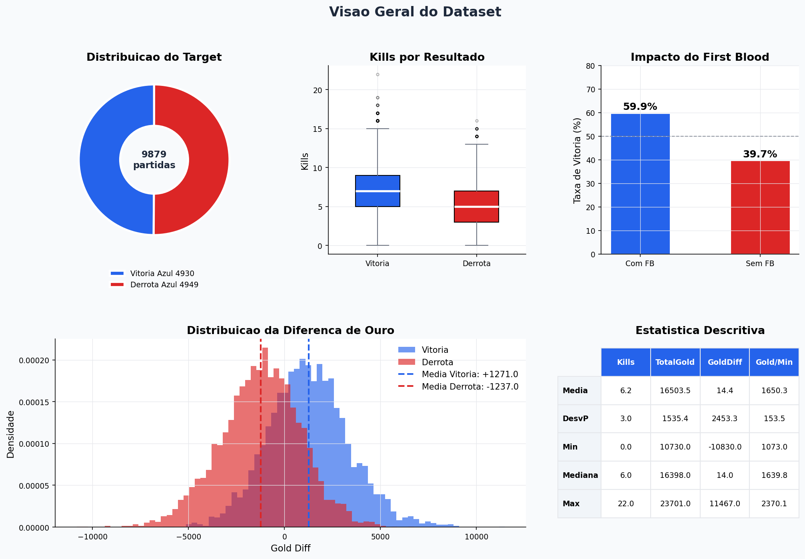 | 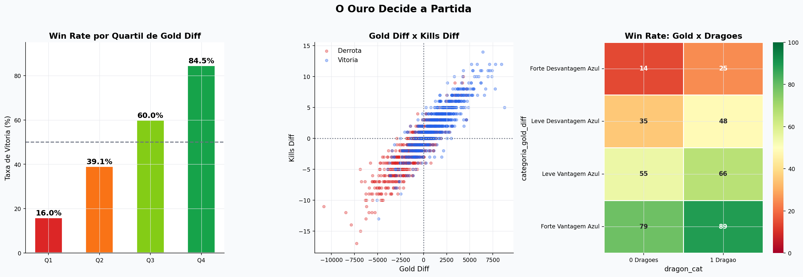 |

| Early Game | Perfil Vencedor |
|:----------:|:---------------:|
| 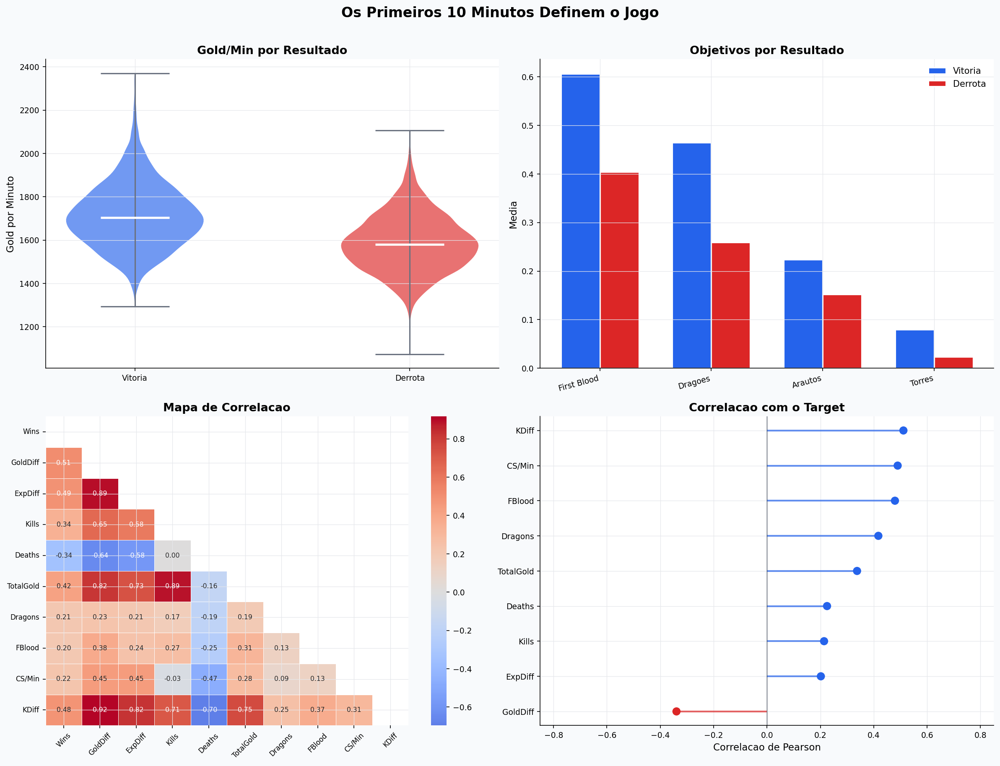 | 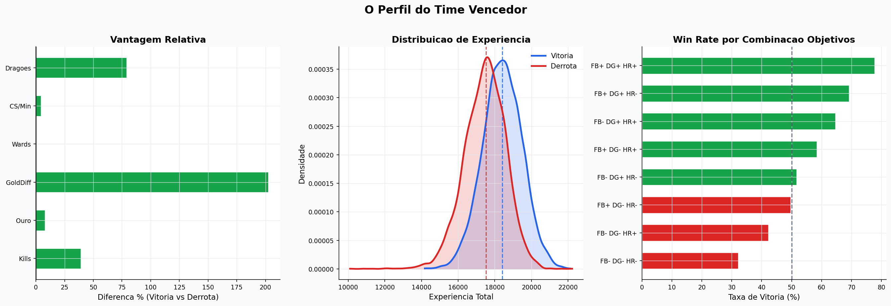 |

### Pré-Processamento e PCA

| Multicolinearidade | Variância PCA |
|:-----------------:|:-------------:|
| 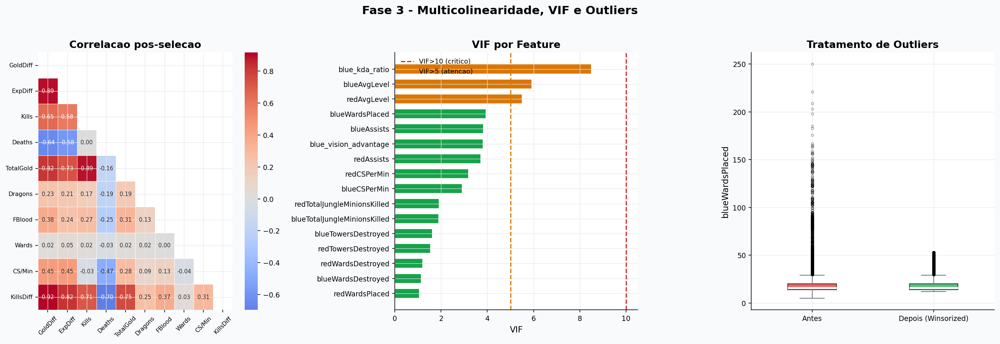 | 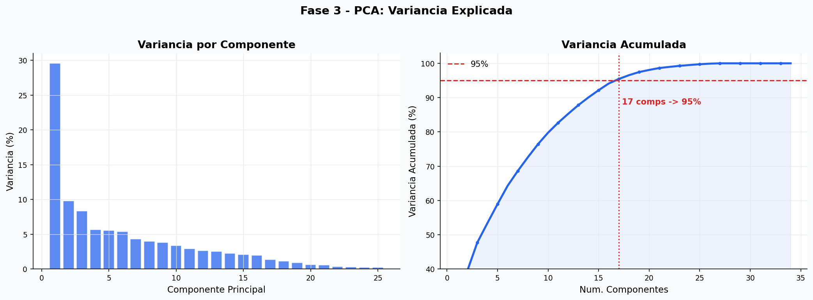 |

### K-Means — Perfis de Partida

| Elbow + Silhouette | Perfil dos Clusters |
|:------------------:|:-------------------:|
| 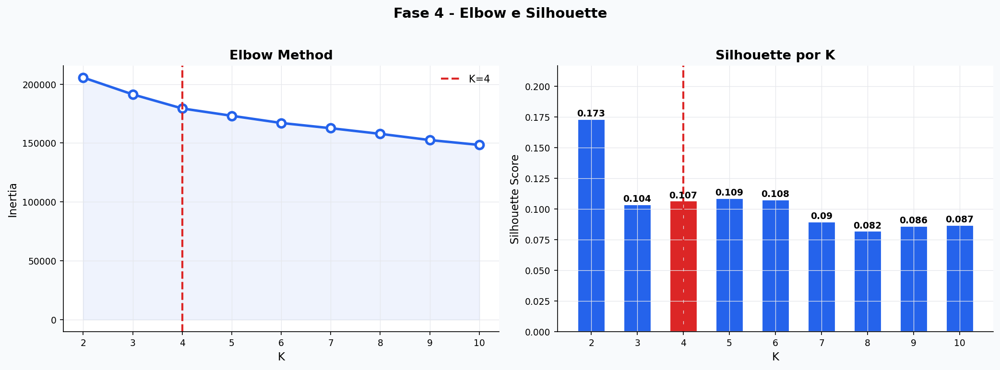 | 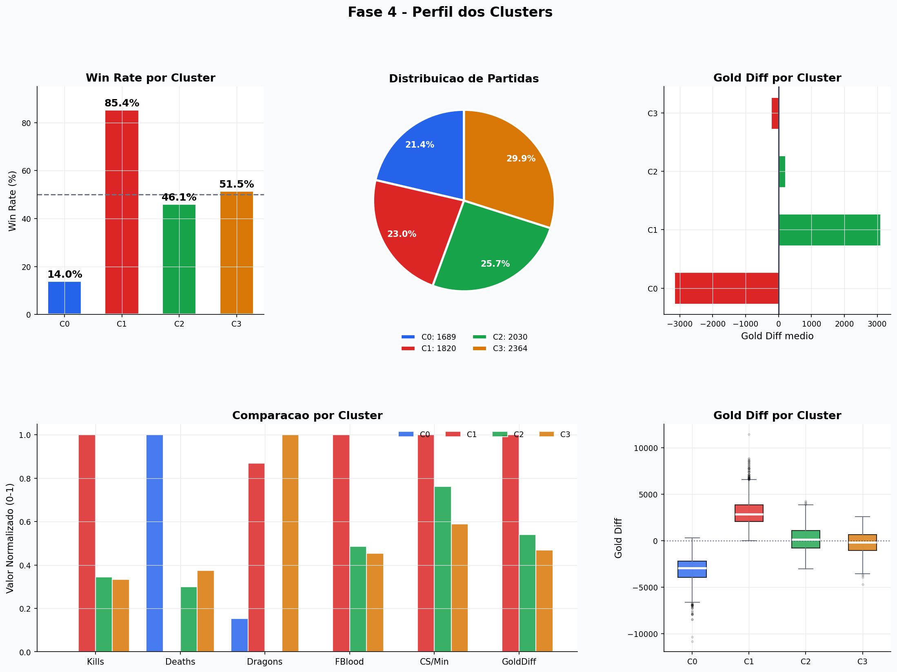 |

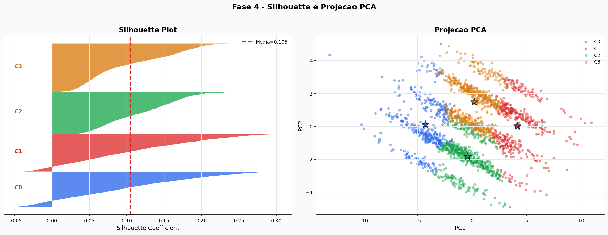

### Batalha dos Modelos

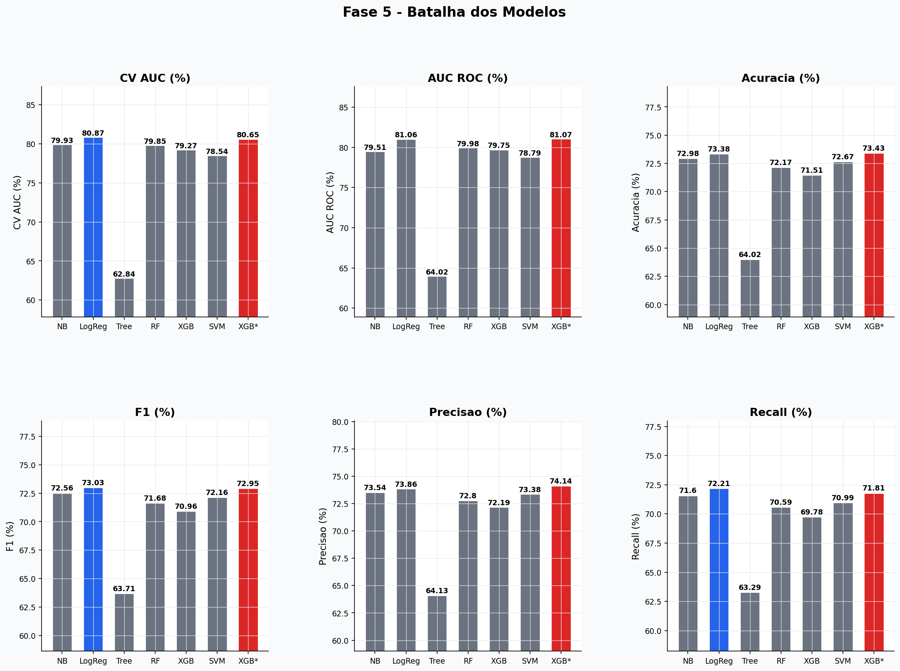

| Duelos Diretos | Curva ROC + Ranking |
|:--------------:|:-------------------:|
| 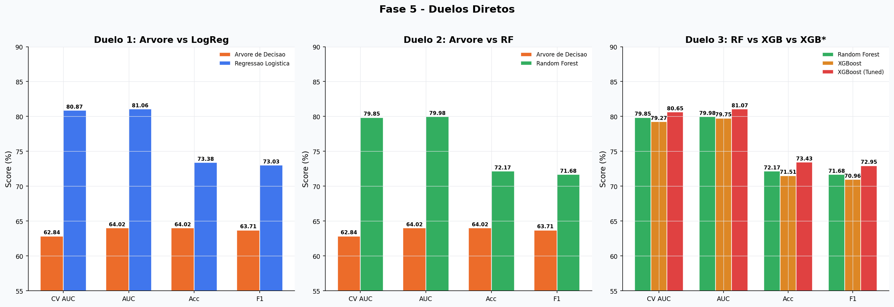 | 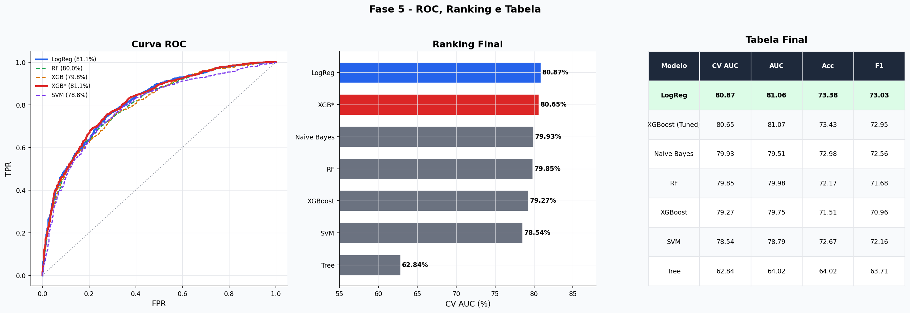 |

### Avaliação Final

| Matriz de Confusão + ROC | Feature Importance |
|:------------------------:|:-----------------:|
| 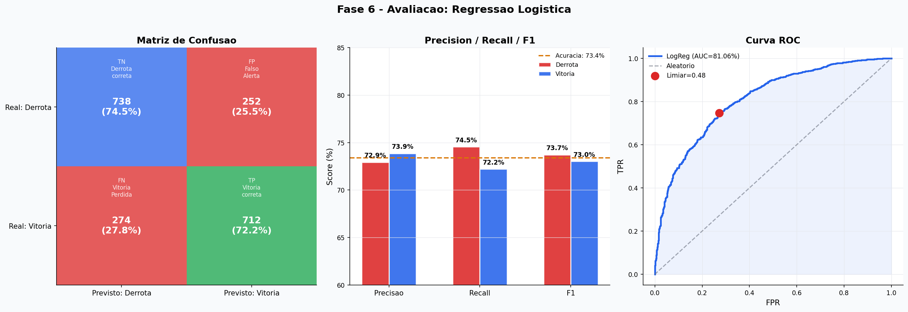 | 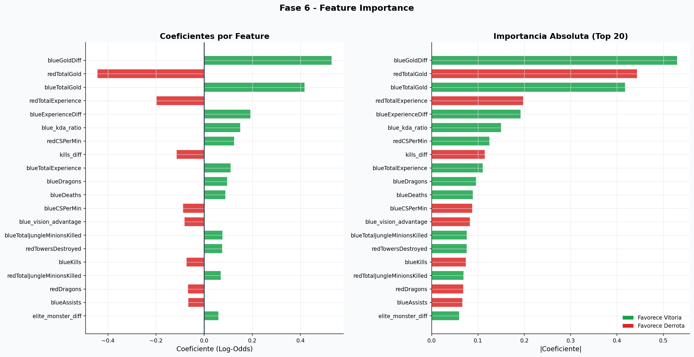 |

---

## 🗂️ Estrutura do Projeto

```
lol-ranked-prediction/
│
├── 📓 fase_01_setup_sql.ipynb
├── 📓 fase_02_eda_storytelling.ipynb
├── 📓 fase_03_preprocessing_pipeline.ipynb
├── 📓 fase_04_kmeans.ipynb
├── 📓 fase_05_modelagem.ipynb
├── 📓 fase_06_avaliacao.ipynb
├── 📓 fase_07_bi_dax.ipynb
├── 📓 RODAR_NO_COLAB.ipynb
│
├── 🖼️ grafico_01 ao grafico_14.png
│
├── outputs/
│   └── data/
│       ├── dataset_tratado_powerbi.csv   ⭐ Checkpoint BI
│       ├── cluster_profile.csv
│       └── model_results.csv
│
├── 📄 requirements.txt
├── 📄 .gitignore
└── 📄 README.md
```

---

## ⚙️ Como Executar

```bash
# 1. Clone o repositório
git clone https://github.com/BrunoMarino2001/lol-ranked-prediction.git
cd lol-ranked-prediction

# 2. Instale as dependências
pip install -r requirements.txt

# 3. Execute os notebooks em ordem
# fase_01_setup_sql.ipynb → fase_07_bi_dax.ipynb
```

> 💡 **Google Colab:** use o `RODAR_NO_COLAB.ipynb` — gera tudo automaticamente a partir do CSV.

---

## 🗓️ Roadmap do Projeto

```
✅ Fase 1 — Setup, SQLite e Ingestão de Dados
✅ Fase 2 — EDA e Storytelling (14 visualizações)
✅ Fase 3 — Pré-Processamento + Checkpoint BI
✅ Fase 4 — K-Means: 4 perfis de partida identificados
✅ Fase 5 — Batalha de 6 modelos + GridSearchCV
✅ Fase 6 — Avaliação + Feature Importance
✅ Fase 7 — Plano de BI + 7 Fórmulas DAX
```

---

## 🛠️ Stack Tecnológica

| Categoria | Tecnologia |
|-----------|------------|
| Linguagem | Python 3.10+ |
| Banco de Dados | SQLite3 |
| Manipulação | Pandas, NumPy |
| Visualização | Matplotlib, Seaborn, SciPy |
| Pré-processamento | Scikit-learn (Pipeline, StandardScaler, PCA) |
| Clusterização | KMeans, Silhouette Score |
| Modelos ML | GaussianNB, LogisticRegression, DecisionTree, RandomForest, SVM, XGBoost |
| Otimização | GridSearchCV, StratifiedKFold (5-Fold) |
| BI | Power BI + DAX |
| Ambiente | Jupyter Notebook / Google Colab |
| Versionamento | Git / GitHub |

---

## 📈 Evolução do Pipeline

| Fase | Ação | Resultado |
|------|------|-----------|
| 1 | CSV → SQLite → DataFrame + SQL avançado | 9.879 × 47 (6 features derivadas) |
| 3 | Remoção de redundâncias + Winsorizing | 9.879 × 35 |
| 3 | Train/Test split (80/20 stratified) | 7.903 treino / 1.976 teste |
| 3 | PCA (95% variância) | 7.903 × **17 componentes** |
| 4 | K-Means K=4 | 4 clusters identificados |
| 5 | 6 modelos + GridSearchCV | CV AUC vencedor: **80,87%** |
| 6 | Avaliação final | AUC ROC: **81,06%** |

---

*Projeto finalizado | Modelo: Regressão Logística | AUC ROC: 81,06% | Acurácia: 73,38%*
